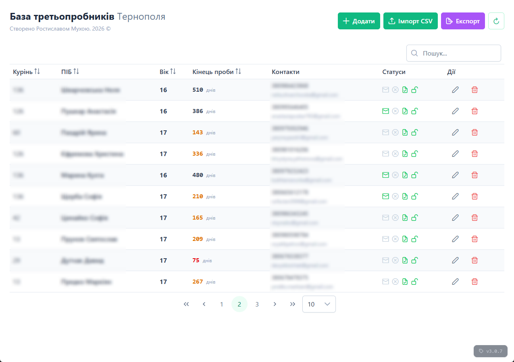
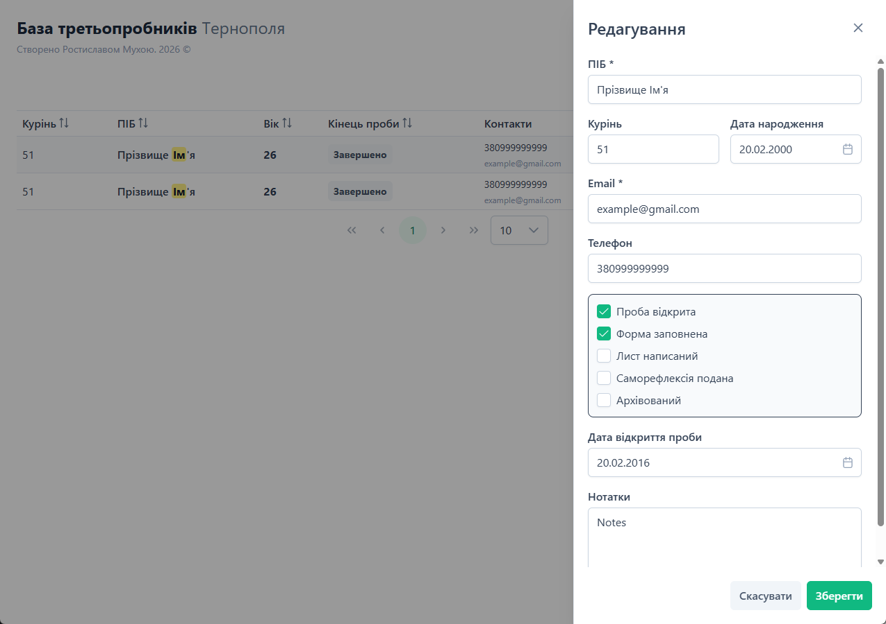

# ProjectK.3PDB

**ProjectK.3PDB** — це спеціалізований десктопний клієнт, розроблений для автономного управління процесами вищої сертифікації всередині організації. Додаток спроектований як легке, локальне рішення для менеджерів (референтів), що відповідають за ведення обліку учасників на фінальних етапах їхньої освітньої програми.

## 🖥 Концепція "Local-First"

На відміну від основної веб-платформи, версія **3PDB** (3rd Probe Database) створена для роботи в ізольованому середовищі. Це дозволяє адміністраторам мати миттєвий доступ до критичних даних без залежності від стабільності інтернет-з'єднання, забезпечуючи високу швидкість відгуку інтерфейсу та безпеку збереження даних на фізичному носії.

## 🛠 Технологічний стек

Додаток використовує гібридну архітектуру, що поєднує потужність десктопних рішень та гнучкість сучасних веб-технологій:

* **Backend:** .NET — забезпечує стабільну бізнес-логіку та обробку даних.
* **Frontend:** Angular — реалізація складних реактивних форм та динамічних таблиць.
* **Database:** SQLite — компактна, вбудована реляційна база даних, що не потребує окремого сервера.
* **Desktop Wrapper:** застосунок загорнутий у десктопну оболонку для нативного запуску в середовищі Windows.

## 🧩 Ключовий функціонал

* **Certification Management:** Спеціалізований облік учасників, що проходять кваліфікаційні випробування (3-тя проба). Моніторинг статусів, термінів та виконання критеріїв.
* **Local Data Vault:** Швидка робота з великими реєстрами учасників через локальну базу даних SQLite.
* **Offline Synchronization:** Проектування з можливістю майбутньої інтеграції та синхронізації даних з центральною ERP-системою Project K.
* **User Interface:** Мінімалістичний інтерфейс, оптимізований для швидкого введення великої кількості документальної інформації.

## 📈 Перспективи розвитку

Проєкт розглядається як автономний модуль, який у майбутньому стане частиною глобальної екосистеми Project K. Це дозволить поєднати переваги локального професійного інструменту з хмарною аналітикою основної платформи.

## UI

